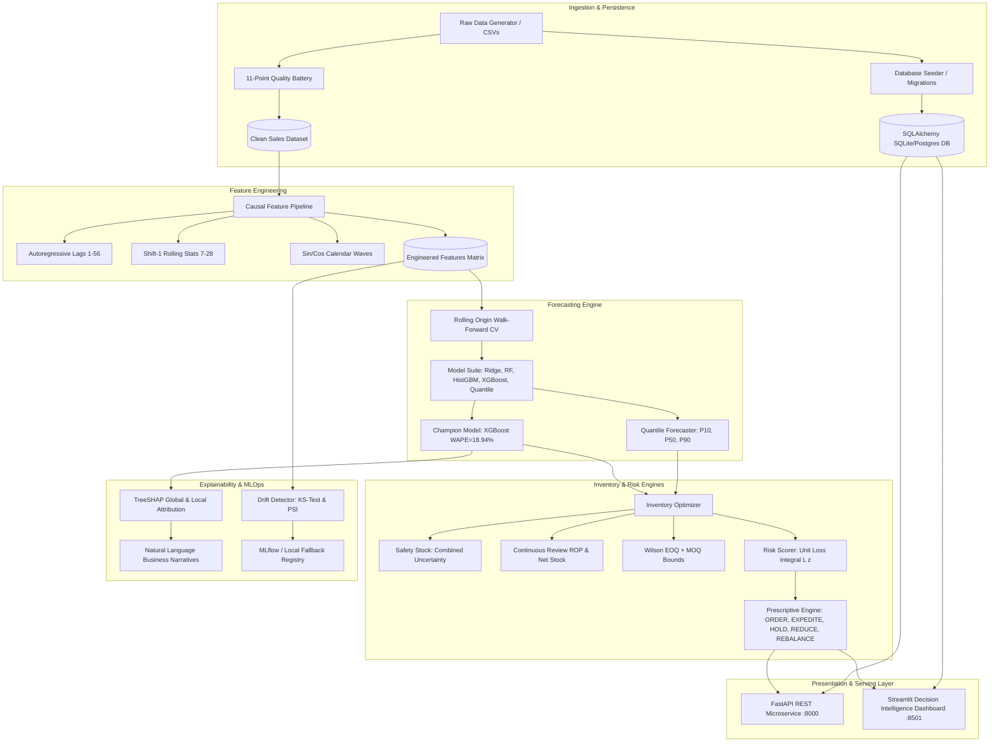

# 🔮 Project FORESIGHT
### Enterprise AI-Powered Demand Forecasting & Multi-Echelon Inventory Intelligence Platform

[](https://python.org)
[](https://fastapi.tiangolo.com)
[](https://streamlit.io)
[](https://www.sqlalchemy.org/)
[](https://xgboost.readthedocs.io)
[](https://pytest.org)
[](LICENSE)

---

## ⚡ Quick Start (Easiest Way to Run)

You can run everything directly from the project root using simple 1-line commands:

### 1. 🖥️ Launch the Interactive Web Dashboard
```bash
streamlit run app.py
```
*Or simply:*
```bash
python run_dashboard.py
```
*On Windows, you can also just double-click:* `start_dashboard.bat`  
👉 Opens automatically in your browser at: **[http://localhost:8501](http://localhost:8501)**

---

### 2. 🚀 Launch the FastAPI REST Service
```bash
python run_api.py
```
*On Windows, you can also just double-click:* `start_api.bat`  
👉 Interactive Swagger Documentation: **[http://localhost:8000/docs](http://localhost:8000/docs)**

---

### 3. 🔄 Run the Complete End-to-End Pipeline
```bash
python run_pipeline.py
```
*On Windows, you can also just double-click:* `run_pipeline.bat`  
👉 Runs Data Generation ➔ 11-point Quality Audit ➔ Feature Engineering ➔ XGBoost Model Training ➔ Inventory Optimization ➔ Financial Risk Engine ➔ TreeSHAP Explainability ➔ MLOps Drift Monitoring in one pass!

---

### 4. 🎛️ Unified CLI Control (`main.py`)
```bash
python main.py dashboard    # Launch Web UI (port 8501)
python main.py api          # Launch FastAPI REST service (port 8000)
python main.py pipeline     # Re-run full pipeline
python main.py verify       # Run 15-point verification suite
python main.py test         # Run all 115 automated tests
```

---

## 📖 System Architecture & Core Capabilities



---

## 🗄️ Database Architecture & Repositories

Project FORESIGHT includes a production-ready **SQLAlchemy 2.0** persistence layer with **Alembic** migration support:

### Core ORM Entities (`src/foresight/database/models/`)
- **`Product`**: SKU master attributes (`sku_id`, `category`, `unit_cost`, `unit_price`, `lead_time_days`, `min_order_qty`, etc.).
- **`SalesRecord`**: Daily sales transactions, pricing, and promotional flags.
- **`InventoryRecord`**: Daily on-hand, on-order, and backorder snapshots.
- **`ForecastRecord`**: Forward point forecasts and quantile intervals ($P_{10}, P_{90}$).
- **`RiskAssessmentRecord`**: Quantified financial exposure, stockout probabilities, and loss integrals.
- **`RecommendationRecord`**: Actionable work orders (`ORDER`, `EXPEDITE`, `REDUCE`, `HOLD`, `MONITOR`, `REBALANCE`).
- **`ModelRun`**: Serialized model hyperparameters, metrics, and artifact paths.

### Repository Pattern (`src/foresight/database/repositories/`)
- `ProductRepository`, `SalesRepository`, `InventoryRepository`, `ForecastRepository`, `RiskRepository`, `RecommendationRepository`, `ModelRepository`.

---

## 🌐 FastAPI REST Microservice Endpoints

| Method | Endpoint | Description |
| :--- | :--- | :--- |
| `GET` | `/health` | Liveness & model pre-warm probe |
| `POST` | `/api/v1/forecast/predict` | Real-time point prediction + quantile bands |
| `POST` | `/api/v1/forecast/predict/batch` | Batch forecasting across SKU-store portfolio |
| `POST` | `/api/v1/inventory/optimize` | Continuous review policy (SS, ROP, EOQ, Health) |
| `POST` | `/api/v1/risk/assess` | Financial exposure & unit normal loss integrals |
| `POST` | `/api/v1/risk/prescribe` | Prescriptive work order generation |
| `POST` | `/api/v1/risk/simulate-scenario` | Macroeconomic stress & disruption simulation |
| `POST` | `/api/v1/explain/drivers` | Local TreeSHAP attributions & narratives |
| `GET` | `/api/v1/products` | Database product catalog query with pagination |
| `GET` | `/api/v1/inventory/{sku_id}` | Latest multi-store inventory snapshot |
| `GET` | `/api/v1/risk/{sku_id}` | Real-time financial risk assessment |
| `GET` | `/api/v1/recommendation/{sku_id}` | Active work orders for SKU |
| `GET` | `/api/v1/model-performance` | Walk-forward cross-validation leaderboard |
| `GET` | `/api/v1/data-quality` | Automated 11-point data quality scorecard |

---

## 🧪 Testing & Verification Battery

Run all **115 automated unit, integration, and API tests**:
```bash
python -m pytest -v
```

Run the automated **15-point master end-to-end verification battery**:
```bash
python scripts/e2e_verification.py
```

---

## 📄 License
MIT License. Built for Enterprise Demand Intelligence and Supply Chain Analytics.
